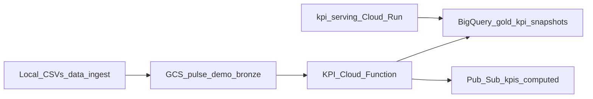

# Pulse: current implemented stack (Assignment 2)

Short reference for teammates (especially **operational intelligence**): what exists today from **ingest → KPIs → read API**, and how your layer plugs in.

Full architecture goals: [docs/Assignment2-Outline.md](docs/Assignment2-Outline.md).

---

## End-to-end flow (implemented)



| Stage | What it does | Code / location |
|-------|----------------|-----------------|
| **Ingest** | Uploads two CSVs under `ingest/<run_id>/`, then `ready.json` so the function runs once both files exist. | [app/infra/data-ingest-uploader/upload_ingest_to_gcs.py](app/infra/data-ingest-uploader/upload_ingest_to_gcs.py) |
| **KPI compute** | Gen2 Cloud Function on **GCS object finalize** for `*/ready.json`. Reads the two CSVs from the same prefix, builds **weekly** KPI rows, **WRITE_TRUNCATE** loads BigQuery, publishes Pub/Sub. | [app/kpi-analytics/kpi-compute/main.py](app/kpi-analytics/kpi-compute/main.py) |
| **KPI serving** | Read-only **FastAPI** on **Cloud Run** (or local): parameterized BigQuery queries only, no SQL from callers. | [app/kpi-analytics/kpi-serving/](app/kpi-analytics/kpi-serving/) |

**Not built in repo yet (your work):** MCP server proxying HTTP to `kpi-serving`, ADK orchestrator + agents, Pub/Sub consumer on `kpis-computed` (see outline).

---

## Constants to align on

| Item | Value |
|------|--------|
| **GCP project** | `ada26-pulse-project` (used in code; confirm with `gcloud config get-value project`) |
| **GCS bucket** | `pulse-demo-bronze` |
| **Ingest prefix** | `ingest/<UTC-run-id>/` (from uploader) |
| **Trigger object** | `.../ready.json` (function ignores other keys) |
| **CSV names** | `financial_clean.csv`, `sales_marketing_clean.csv` (same prefix as `ready.json`) |
| **Demo tenant** | `pulse-demo` (Pub/Sub attribute, JSON marker, and **serving** path allowlist) |
| **BigQuery table** | `ada26-pulse-project.kpi_analytics_gold.gold_kpi_snapshots` |
| **Pub/Sub topic** | `kpis-computed` (published **after** successful BQ load; message attributes include `tenant_id`, `run_id`, `trace_id`) |
| **KPI grain in BQ** | `period_grain = weekly` (Sun-based weeks in compute) |

---

## Run ingest locally

From repo root (paths in script assume this layout):

- Source files: `data/ingest/financial_clean.csv`, `data/ingest/sales_marketing_clean.csv`
- Run the uploader (activate env / install `google-cloud-storage` as needed).

See comments in [upload_ingest_to_gcs.py](app/infra/data-ingest-uploader/upload_ingest_to_gcs.py) for `project_id` / `bucket_name`.

---

## KPI Cloud Function (deploy note)

Deploy line is commented at the top of [main.py](app/kpi-analytics/kpi-compute/main.py) (bucket filter `pulse-demo-bronze`, `us-central1`, entrypoint `compute_kpis`).

After a successful run, **the gold table is replaced** for that load (`WRITE_TRUNCATE`).

---

## KPI serving API (for agents / MCP)

**Purpose:** HTTP only; maps to stable JSON for tools.

**Base URL:** your Cloud Run URL after deploy (example pattern: `https://pulse-kpi-serving-<PROJECT_NUMBER>.europe-west4.run.app`). Local: `http://127.0.0.1:8080`.

**Tenant:** path segment must be `pulse-demo` or you get **404**.

| Method | Path | Meaning |
|--------|------|--------|
| GET | `/health` | Liveness |
| GET | `/kpis/pulse-demo/domains` | Distinct `domain` values |
| GET | `/kpis/pulse-demo/metrics?domain=` | Distinct `metric_name` (optional `domain`) |
| GET | `/kpis/pulse-demo/latest?domain=` | Latest row per metric (optional `domain` filter) |
| GET | `/kpis/pulse-demo/latest/{domain}/{metric_name}` | Latest for one metric |
| GET | `/kpis/pulse-demo/metrics/{domain}/{metric_name}/history?limit=` | Weekly history; default limit 12, **capped** by `HISTORY_MAX_LIMIT` (default **52**). **Newest week first** in `items`. |

**Env (Cloud Run / local):** `BQ_TABLE_ID`, `ALLOWED_TENANT_ID`, optional `HISTORY_DEFAULT_LIMIT`, `HISTORY_MAX_LIMIT`. Details: [app/kpi-analytics/kpi-serving/README.md](app/kpi-analytics/kpi-serving/README.md).

**OpenAPI:** `{BASE_URL}/docs`

---

## What operational intelligence should do next

1. **Subscribe** to **`kpis-computed`** (push to orchestrator or pull, per your design) to start the agent pipeline when new KPIs land.
2. **Implement MCP** as a thin client to **`kpi-serving`** (same paths as above); do not query BigQuery from agents.
3. **Document for prompts:** history responses are **newest-first**; use `period_start` / `period_end` for business time, not only `computed_at`.

---

## Repo layout (KPI side)

```text
app/
  infra/data-ingest-uploader/     # GCS upload + ready.json
  kpi-analytics/
    kpi-compute/                  # Cloud Function
    kpi-serving/                  # Cloud Run REST (deployed separately)
  operational-intelligence/       # agents (to be filled in)
```

Last updated: reflects repo as of KPI serving + compute + ingest uploader in `app/`.
